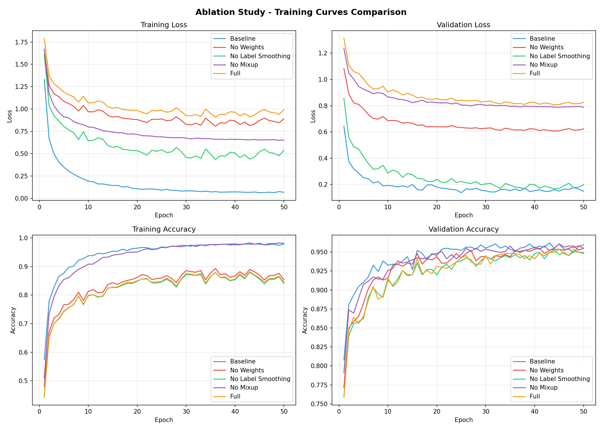

# RealWaste: Engineering a Robust Waste Classification System

> **An investigation into the trade-offs between dataset diversity and regularization techniques in real-world computer vision applications.**

---

## Problem Statement

This project addresses the challenge of building a waste classification model capable of generalizing to real-world deployment scenarios—specifically, environments where waste materials exhibit significant degradation, occlusion, and variable lighting conditions. I began with the **RealWaste** dataset, which comprises images captured directly from landfill conveyor belts, representing authentic waste in various states of deterioration.

The initial approach employed a pretrained ResNet18 architecture, fine-tuned on 9 waste categories. While achieving approximately **87% accuracy**, the model exhibited systematic misclassification patterns, particularly confusing **white metal cans** with **white crumpled paper**. Despite these materials possessing distinct physical properties—rigidity and specular reflectance versus softness and matte finish—the model failed to discriminate between them.


This observation revealed a fundamental limitation: the model was learning color-based heuristics rather than material-specific structural features.

---

## Experimental Methodology

### Architecture Optimization
I transitioned to **EfficientNet-B0**, selected for its superior parameter efficiency and enhanced capability for fine-grained feature extraction. While computational efficiency improved, the core misclassification patterns persisted, indicating that architectural changes alone were insufficient to address the underlying feature learning problem.

### Explainability Analysis with GradCAM
To investigate the model's decision-making process, I implemented **Gradient-weighted Class Activation Mapping (GradCAM)**. This visualization technique revealed that the model was not attending to discriminative material properties. For metal objects, attention should concentrate on specular highlights and geometric structure; for paper, on crease patterns and fold lines. Instead, the model relied primarily on overall brightness and superficial texture patterns.


### Data Augmentation Strategy
I developed a comprehensive augmentation pipeline to enforce learning of material-specific features:

1. **RandomGrayscale (p=0.3)**: Designed to reduce color dependency and encourage shape-based learning. This improved metal classification but degraded paper recognition, as grayscale paper became visually similar to plastic materials.

2. **RandomAdjustSharpness (factor=1.5)**: Enhanced edge definition to improve texture discrimination. However, excessive sharpness caused metallic surface deformations to resemble paper creases.

3. **ColorJitter**: Introduced controlled brightness and contrast variation to preserve material-specific properties such as specular reflectance.

4. **RandomAffine (scale 0.8-1.2)**: Addressed scale invariance issues observed in close-up imagery.

5. **Mixup Regularization**: Implemented convex combinations of training samples to create smooth decision boundaries and improve robustness to ambiguous cases.

6. **Label Smoothing (0.1)**: Applied soft labels (0.9/0.1) instead of hard targets to prevent overconfident predictions on difficult samples.

7. **Weighted Cross-Entropy**: Assigned higher loss weights to underrepresented classes to address class imbalance.

Despite extensive hyperparameter tuning, validation performance plateaued, suggesting a fundamental data limitation.

---

## Dataset Augmentation Through Multi-Source Integration

Analysis revealed that the model's poor performance on clean, undegraded waste stemmed from a distributional gap in the training data. The RealWaste dataset, while representative of real-world conditions, lacked examples of pristine materials commonly encountered in controlled recycling environments.

### TrashNet Integration
I incorporated the **TrashNet** dataset, which provides studio-quality imagery with consistent lighting and minimal degradation. This created a complementary data distribution:

- **RealWaste**: Provides robustness to degradation, occlusion, and challenging lighting conditions
- **TrashNet**: Establishes canonical representations of clean material states

The hybrid dataset enabled the model to learn both idealized material features and their degraded real-world manifestations, resulting in immediate performance improvements.


---

## Ablation Study: Quantifying Component Contributions

To rigorously evaluate the contribution of each training technique, I conducted a systematic ablation study. Five model variants were trained for 50 epochs with identical hyperparameters, random seeds, and data splits.

### Experimental Design
| Configuration          | Description                                                |
| ---------------------- | ---------------------------------------------------------- |
| **Baseline**           | EfficientNet-B0 + basic augmentations + standard CrossEntropy |
| **No Weights**         | Full pipeline without class weighting                      |
| **No Label Smoothing** | Full pipeline without label smoothing                      |
| **No Mixup**           | Full pipeline without Mixup regularization                 |
| **Full**               | Complete pipeline with all techniques                      |

### Results

| Configuration          | Best Val Acc | Test Acc  | Δ from Full |
| ---------------------- | ------------ | --------- | ----------- |
| **Baseline**           | 96.21%       | **95.42%** | +1.53%      |
| No Mixup               | 96.07%       | 95.28%    | +1.39%      |
| No Weights             | 95.79%       | 94.72%    | +0.83%      |
| No Label Smoothing     | 95.23%       | 94.03%    | +0.14%      |
| Full                   | 95.37%       | 93.89%    | —           |

Unexpectedly, the baseline configuration achieved superior test performance compared to the fully-regularized model.

### Training Curves Comparison


### Analysis

The ablation study revealed three key findings:

1. **Dataset diversity supersedes regularization necessity.** The combination of RealWaste and TrashNet provided sufficient distributional coverage, rendering additional regularization techniques redundant. The model encountered both clean and degraded material states during training, eliminating the need for synthetic data augmentation via Mixup.

2. **Regularization over-application degrades performance.** The cumulative effect of Mixup, Label Smoothing, and Class Weighting introduced excessive constraints on the optimization landscape. In the absence of overfitting, these techniques impeded convergence to optimal solutions.

3. **Simplicity enables faster convergence.** The baseline model, unburdened by multiple regularization mechanisms, achieved superior generalization through more efficient gradient descent.

> [!IMPORTANT]  
> This study demonstrates that dataset diversity can obviate the need for sophisticated regularization techniques, and in some cases, excessive regularization may be counterproductive.

---

## Final Model Architecture

Based on ablation study results, the production model employs the baseline configuration:

| Component              | Specification                  |
| ---------------------- | ------------------------------ |
| **Architecture**       | EfficientNet-B0 (ImageNet pretrained) |
| **Input Resolution**   | 224 × 224                      |
| **Augmentation**       | Resize, RandomCrop, HorizontalFlip |
| **Loss Function**      | Standard Cross-Entropy         |
| **Optimizer**          | AdamW (lr=1e-4, weight_decay=1e-4) |
| **Scheduler**          | CosineAnnealingLR              |
| **Training Duration**  | 50 epochs                      |

---

## Performance Evaluation

The final model achieves **95.42% accuracy** on the stratified test set (10% of total data):

### Per-Class Metrics

| Class               | Precision | Recall | F1-Score | Support |
| ------------------- | --------- | ------ | -------- | ------- |
| Cardboard           | 0.99      | 1.00   | 0.99     | 87      |
| Food Organics       | 0.95      | 1.00   | 0.98     | 42      |
| Glass               | 0.92      | 0.98   | 0.95     | 93      |
| Metal               | 0.98      | 0.95   | 0.97     | 121     |
| Miscellaneous Trash | 0.90      | 0.86   | 0.88     | 50      |
| Paper               | 0.98      | 0.95   | 0.97     | 110     |
| Plastic             | 0.95      | 0.91   | 0.93     | 141     |
| Textile Trash       | 0.86      | 0.94   | 0.90     | 32      |
| Vegetation          | 0.94      | 1.00   | 0.97     | 44      |

### Aggregate Performance
| Metric       | Value    |
| ------------ | -------- |
| **Accuracy** | **95.42%** |
| Macro Avg F1 | 0.95     |
| Weighted Avg F1 | 0.95  |

### Confusion Matrix


---

## Implementation

### Installation
```bash
git clone https://github.com/Ezzzzz4/waste_classification
cd waste_classification
pip install -r requirements.txt
```

### Project Structure
```
waste_classification/
├── ablation/
│   └── train.py              # Ablation study training script
├── evaluate/
│   ├── classification_report.txt
│   ├── confusion_matrix.png
│   └── evaluate_model.ipynb  # Interactive evaluation notebook
├── utils/
│   └── gradcam.py            # GradCAM implementation
├── weights/
│   ├── best_waste_model.pth  # Production model (Baseline)
│   └── ablation_*/           # Ablation experiment weights
├── assets/                   # Images for README
├── app.py                    # Gradio web application
├── evaluate.py               # Model evaluation script
├── model.py                  # WasteClassifier architecture
├── train_model.ipynb         # Main training notebook
├── requirements.txt
└── README.md
```

### Web Application
Launch the Gradio interface for real-time classification:
```bash
python app.py
```
The app includes a model selection dropdown to compare different ablation variants.

### Model Evaluation
```bash
# Evaluate the production model (default)
python evaluate/evaluate.py

# Evaluate a specific ablation model
python evaluate/evaluate.py --model baseline
python evaluate/evaluate.py --model full
python evaluate/evaluate.py --model no_mixup

# Evaluate all models and generate comparison
python evaluate/evaluate.py --all
```

### Training
1. Download the datasets:
   - [RealWaste](https://archive.ics.uci.edu/dataset/908/realwaste) (UCI Repository)
   - [TrashNet](https://github.com/garythung/trashnet) (GitHub)
2. Extract and place in `dataset/` directory
3. Run the training notebook: `train_model.ipynb`

### Ablation Study
To reproduce the ablation experiments:
```bash
# Run all experiments (5 models × 50 epochs each)
python ablation/train.py --no_wandb

# Run a specific experiment
python ablation/train.py --experiment baseline --no_wandb
python ablation/train.py --experiment full --epochs 30 --no_wandb
```

Available experiments: `baseline`, `no_weights`, `no_ls`, `no_mixup`, `full`

---

## Technical Stack

| Category          | Technology                                      |
| ----------------- | ----------------------------------------------- |
| **Framework**     | PyTorch 2.0+, Torchvision                       |
| **Architecture**  | EfficientNet-B0 (ImageNet pretrained)           |
| **Explainability**| GradCAM                                         |
| **Compute**       | CUDA 11.8+                                      |
| **Deployment**    | Gradio                                          |
| **Analysis**      | Scikit-learn, Matplotlib, Seaborn               |

---

## Key Contributions

1. **Dataset complementarity analysis**: Demonstrated that combining datasets with complementary distributions (degraded real-world vs. clean studio imagery) provides superior generalization compared to single-source training.

2. **Empirical regularization study**: Quantified the negative impact of over-regularization when sufficient dataset diversity exists, challenging the assumption that more techniques always improve performance.

3. **GradCAM-guided debugging**: Utilized attention visualization to identify and correct feature learning failures, transitioning from color-based to material-based classification.

4. **Reproducible ablation methodology**: Established a rigorous experimental protocol for evaluating individual component contributions in deep learning pipelines.

---

## References

### Datasets
- **RealWaste**: Single, S., Iranmanesh, S., & Raad, R. (2023). RealWaste: A Novel Real-World Waste Classification Dataset. *UCI Machine Learning Repository*. https://archive.ics.uci.edu/dataset/908/realwaste
- **TrashNet**: Yang, M., & Thung, G. (2016). Classification of Trash for Recyclability Status. https://github.com/garythung/trashnet

### Methodologies
- **EfficientNet**: Tan, M., & Le, Q. V. (2019). EfficientNet: Rethinking Model Scaling for Convolutional Neural Networks. *International Conference on Machine Learning (ICML)*.
- **GradCAM**: Selvaraju, R. R., Cogswell, M., Das, A., Vedantam, R., Parikh, D., & Batra, D. (2017). Grad-CAM: Visual Explanations from Deep Networks via Gradient-Based Localization. *International Conference on Computer Vision (ICCV)*.
- **Mixup**: Zhang, H., Cisse, M., Dauphin, Y. N., & Lopez-Paz, D. (2018). mixup: Beyond Empirical Risk Minimization. *International Conference on Learning Representations (ICLR)*.
- **Label Smoothing**: Müller, R., Kornblith, S., & Hinton, G. (2019). When Does Label Smoothing Help? *Neural Information Processing Systems (NeurIPS)*.

---

## Author

**Amirbek Yaqubboyev**  
📧 akubbaevamirbek@gmail.com  
🔗 [GitHub](https://github.com/Ezzzzz4)

*Last updated: January 2026*
