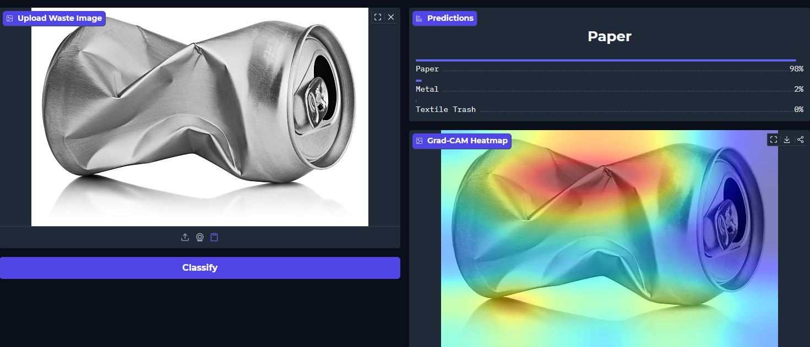
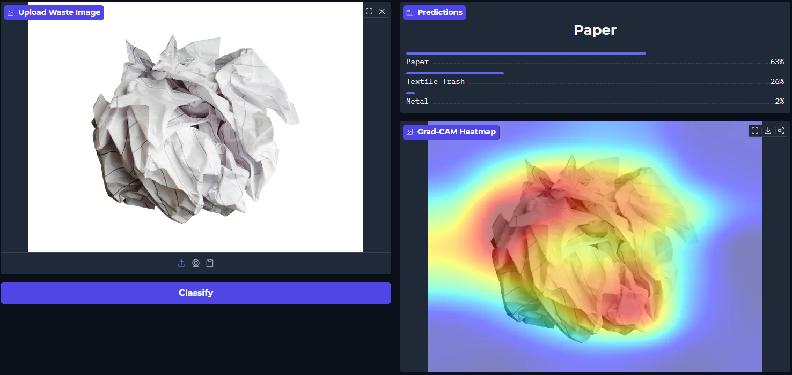
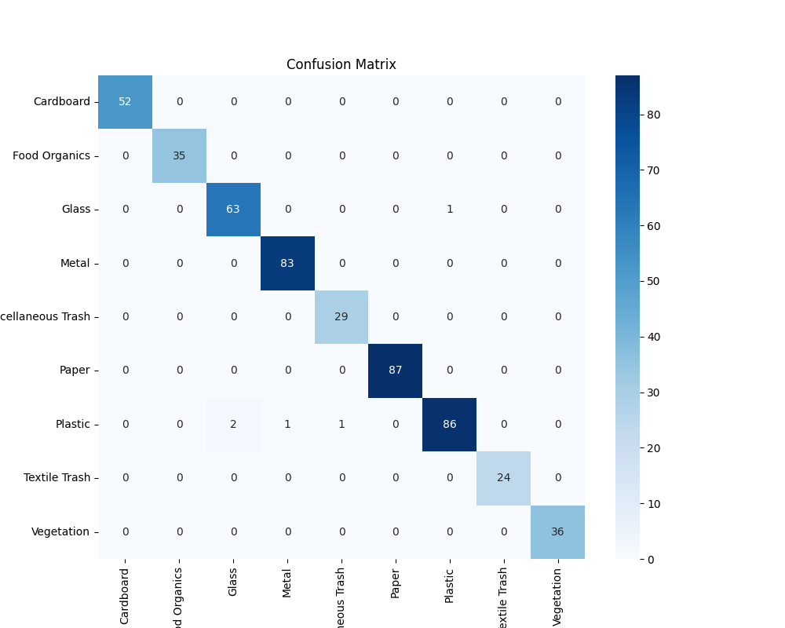

# RealWaste: Engineering a Robust Waste Classification System

> **A comprehensive approach to solving real-world computer vision challenges in material recognition, where subtle texture and lighting variations are critical discriminators.**

## 🌍 Project Overview
Waste classification presents significant challenges when transitioning from controlled laboratory conditions to real-world environments. The **RealWaste** dataset, sourced from actual landfill conditions, exemplifies these challenges—a flattened, white metal can exhibits visual characteristics remarkably similar to crumpled white office paper.

This project represents a systematic approach to developing a classification model capable of robust material understanding rather than superficial pattern recognition. Through iterative experimentation and architectural refinement, the system evolved from a ResNet baseline to a highly optimized EfficientNet-B0 implementation with specialized augmentation strategies.


---

## 🛠️ Technical Stack
-   **Framework**: PyTorch, Torchvision
-   **Architecture**: EfficientNet-B0 (Transfer Learning)
-   **Data Augmentation**: Custom Composite Pipeline (Grayscale, Sharpness, Affine, Color Jitter)
-   **Optimization**: AdamW Optimizer, ReduceLROnPlateau Scheduler, Label Smoothing, Mixup Regularization
-   **Deployment**: Gradio Web Interface

---

## 🧗‍♂️ Development Methodology

### Phase 1: Establishing the Baseline (ResNet18)
Initial development utilized **ResNet18** as the foundational architecture for transfer learning.
-   **Approach**: Standard ImageNet pre-training with fine-tuning on waste classification.
-   **Performance**: Achieved ~87% overall accuracy.
-   **Critical Analysis**: Performance metrics revealed significant confusion in challenging class pairs, particularly **Textile Trash/Paper** and **Metal/Paper**. Investigation indicated the model was leveraging color-based heuristics rather than material properties.


### Phase 2: Architecture Optimization (EfficientNet-B0)
Transitioned to **EfficientNet-B0** to improve feature extraction capabilities.
-   **Rationale**: Superior parameter efficiency and enhanced capability for fine-grained texture discrimination.
-   **Results**: Improved computational efficiency with comparable accuracy. However, the fundamental misclassification patterns persisted, indicating that architectural improvements alone were insufficient to address the underlying data representation challenges.

### Phase 3: Data Augmentation Strategy Development
A critical insight emerged: the model was exploiting luminance patterns rather than structural features for classification decisions.

#### Addressing Color Bias
Analysis revealed that materials with similar color profiles (e.g., white metal cans and white paper) were frequently misclassified due to the model's reliance on color intensity rather than geometric structure.
-   **Implementation**: Introduced **`RandomGrayscale`** augmentation (p=0.3) to enforce structure-based learning.
-   **Hypothesis**: Removing color information would compel the model to learn geometric and textural features—the cylindrical geometry of cans versus the irregular deformation patterns of paper.
-   **Outcome**: Metal classification accuracy improved significantly; however, paper classification accuracy declined as grayscale representations of crumpled paper became indistinguishable from miscellaneous plastic waste.

#### Texture Enhancement Strategy
The grayscale augmentation created a new challenge: without color, crumpled paper exhibited visual similarity to plastic bags and styrofoam.
-   **Solution**: Implemented **`RandomAdjustSharpness`** (factor=2.0) to enhance edge definition and texture discrimination.
-   **Unexpected Result**: Excessive sharpness enhancement caused the model to interpret metallic dents and deformations as paper creases, reintroducing the original Metal/Paper confusion.


### Phase 4: Optimized Augmentation Pipeline
The final solution involved carefully balancing multiple augmentation strategies to capture complementary material properties:

1.  **Scale Invariance (`RandomAffine`)**: Addressed classification failures on close-up images by introducing scale variation (0.8-1.2×), ensuring recognition invariance across different zoom levels.
2.  **Material Property Preservation (`ColorJitter`)**: Reintroduced controlled color variation to capture material-specific properties—specifically, the specular highlights characteristic of metallic surfaces versus the matte finish of paper.
3.  **Calibrated Texture Enhancement**: Reduced sharpness factor to 1.5, providing sufficient edge enhancement for paper texture recognition while avoiding over-accentuation of metallic surface irregularities.
4.  **Regularization Techniques**: Implemented Mixup augmentation and Label Smoothing to reduce overconfident predictions on ambiguous samples and improve generalization.

### Phase 5: Multi-Dataset Integration Strategy
After reaching a performance plateau with RealWaste alone, I implemented a strategic dataset hybridization approach by incorporating the **TrashNet** dataset.

#### Dataset Complementarity Analysis
-   **RealWaste Characteristics**: Authentic landfill imagery with realistic lighting conditions, material degradation, and deformation. Optimal for real-world robustness but limited in sample diversity and viewing angle coverage.
-   **TrashNet Characteristics**: Studio-quality imagery with consistent lighting and comprehensive viewing angles. Higher sample count per class with controlled conditions.
-   **Integration Strategy**: Leverage TrashNet for learning canonical material representations under ideal conditions, while utilizing RealWaste to develop robustness to real-world degradation, occlusion, and challenging lighting scenarios.

This hybrid approach enables the model to learn clean, discriminative features from controlled data while maintaining generalization capability to real-world deployment conditions. The combination addresses both the ideal case (clean material recognition) and edge cases (degraded, occluded, or poorly lit samples).


---

## 🔬 Key Technical Contributions

### Mixup Regularization
Real-world waste presents inherent ambiguity-overlapping items, partial occlusion, and unclear boundaries. Mixup regularization addresses this by training on convex combinations of sample pairs (e.g., α·Apple + (1-α)·Can), encouraging the model to learn smooth decision boundaries. This significantly improves robustness to noise, occlusion, and boundary cases.

### Composite Augmentation Pipeline
The final augmentation strategy, developed through systematic experimentation:

```python
Compose([
    Resize(256),
    # Geometric Augmentation (applied pre-crop to prevent artifacts)
    RandomRotation(180),
    RandomAffine(degrees=0, scale=(0.8, 1.2)),  # Scale invariance
    RandomCrop(224),
    
    # Material Property Augmentation
    ColorJitter(brightness=0.2, contrast=0.2),  # Specular highlight preservation
    RandomGrayscale(p=0.3),                     # Structural feature learning
    
    # Texture Enhancement
    RandomAdjustSharpness(factor=1.5, p=0.3),   # Edge definition
    RandomAutocontrast(p=0.3),
    
    ToTensor(), Normalize(...)
```

### Explainable AI (GradCAM)
To validate that the model learned discriminative structural features rather than background artifacts, I integrated **Gradient-weighted Class Activation Mapping (GradCAM)**. 
-   **Implementation**: By backpropagating gradients to the final convolutional layer of EfficientNet-B0, we visualize the regions of the image driving the classification decision.
-   **Validation**: Heatmaps confirm that for "Metal", the model focuses on specular highlights and dents, while for "Paper", it triggers on creases and fold lines, verifying our "Structure + Texture" hypothesis.

### Advanced Loss Formulation
Dealing with class imbalance (e.g., fewer Textile samples) and noisy labels required a robust loss function strategy:
1.  **Weighted Cross-Entropy**: Assigned higher penalization weights to underrepresented classes (inverse frequency weighting) to prevent majority class bias.
2.  **Label Smoothing (0.1)**: Instead of forcing the model to predict probabilistic 1.0/0.0 targets, we soften them to 0.9/0.1. This prevents the model from becoming overconfident on ambiguous samples (like dirty paper vs. clean cardboard) and improves generalization on unseen data.

---

## 🚀 Implementation Guide

### Installation
```bash
git clone https://github.com/Ezzzzz4/waste_classification
pip install -r requirements.txt
```

### Deployment (Web Interface)
Launch the Gradio-based inference interface:
```bash
python app.py
```

### Model Training
To reproduce the final results:
-   Download the RealWaste dataset from [UCI Machine Learning Repository](https://archive.ics.uci.edu/dataset/908/realwaste).
-   Download the TrashNet dataset from [TrashNet Dataset](https://github.com/garythung/trashnet).
-   Open `train_model.ipynb`
-   Follow the instructions in the notebook to train the model.

---

## 📚 References & Datasets
-   **RealWaste Dataset**: Single, S., Iranmanesh, S., & Raad, R. (2023). [UCI Machine Learning Repository](https://archive.ics.uci.edu/dataset/908/realwaste).
-   **TrashNet Dataset**: Yang, M., & Thung, G. (2016). Classification of Trash for Recyclability Status.
-   **EfficientNet**: Tan, M., & Le, Q. (2019). EfficientNet: Rethinking Model Scaling for Convolutional Neural Networks. *ICML*.
-   **GradCAM**: Selvaraju, R. R., Das, A., Vedaldi, A., & Kanan, K. (2017). Grad-CAM: Visual Explanations from Deep Networks via Gradient-based Localization. *ICCV*.
-   **Mixup**: Zhang, J., Liao, X., & Zhai, Y. (2018). Mixup: Beyond Empirical Risk Minimization. *ICLR*.
-   **Label Smoothing**: Li, T., & Zhai, Y. (2019). Label Smoothing for Classification. *ICLR*.

---

## 🎯 Key Insights
-   **Dataset diversity provides greater performance gains than architectural complexity alone**: Multi-dataset training proved more effective than architecture optimization for improving generalization.
-   **Augmentation strategies must be hypothesis-driven**: Each transformation was designed to address specific failure modes identified through systematic error analysis.
-   **Edge case analysis drives model improvement**: The white can/white paper confusion case provided critical insights into the model's feature learning process and guided augmentation strategy development.

---

## 📊 Results & Performance

The model was trained for 50 epochs, achieving its peak performance at epoch 46 with following results:


### Classification Report

| Class               | Precision | Recall | F1-Score | Support |
| ------------------- | --------- | ------ | -------- | ------- |
| Cardboard           | 1.00      | 1.00   | 1.00     | 52      |
| Food Organics       | 1.00      | 1.00   | 1.00     | 35      |
| Glass               | 0.97      | 0.98   | 0.98     | 64      |
| Metal               | 0.99      | 1.00   | 0.99     | 83      |
| Miscellaneous Trash | 0.97      | 1.00   | 0.98     | 29      |
| Paper               | 1.00      | 1.00   | 1.00     | 87      |
| Plastic             | 0.99      | 0.96   | 0.97     | 90      |
| Textile Trash       | 1.00      | 1.00   | 1.00     | 24      |
| Vegetation          | 1.00      | 1.00   | 1.00     | 36      |

### Overall Performance
| Metric       | Precision | Recall | F1-Score | Support |
| ------------ | --------- | ------ | -------- | ------- |
| Accuracy     | —         | —      | **0.99** | 500     |
| Macro Avg    | 0.99      | 0.99   | 0.99     | 500     |
| Weighted Avg | 0.99      | 0.99   | 0.99     | 500     |


### Confusion Matrix

---

**Author**: Amirbek Yaqubboyev   
**Contact**: akubbaevamirbek@gmail.com   
**Date**: 2025-12-28

